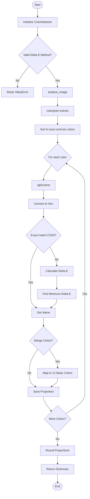

# Color detector

The Colors module analyzes color composition in images, extracting dominant colors and categorizing them into named color categories.

Color detection is carried out using [colorgram.py](https://github.com/obskyr/colorgram.py) and [colour](https://github.com/vaab/colour) for the distance metric. The colors can be classified into the main named colors/hues in the English language, that are red, green, blue, yellow, cyan, orange, purple, pink, brown, grey, white, black.

## Key Features

- **Color Extraction**: Extracts the N most common colors from images using the `colorgram` library (default: 100 colors)
- **Color Naming**: Matches extracted RGB colors to the closest CSS3 color names using Delta-E color difference metrics
- **Color Categorization**: Reduces colors to 12 basic categories: red, green, blue, yellow, cyan, orange, purple, pink, brown, grey, white, black
- **Multiple Delta-E Methods**: Supports 12 different color difference calculation methods:
  - CIE 1976 (default)
  - CIE 1994
  - CIE 2000
  - CMC
  - ITP
  - CAM02-LCD, CAM02-SCD, CAM02-UCS
  - CAM16-LCD, CAM16-SCD, CAM16-UCS
  - DIN99

## Usage

```python
from ammico.colors import ColorDetector

detector = ColorDetector(subdict={"filename": "image.jpg"}, delta_e_method="CIE 1976")
results = detector.analyse_image()
# Returns dict with color percentages: {"red": 0.15, "blue": 0.23, ...}
```

## Output

Returns a dictionary with color names as keys and their percentage presence in the image as values (rounded to 2 decimal places).

## Workflow


