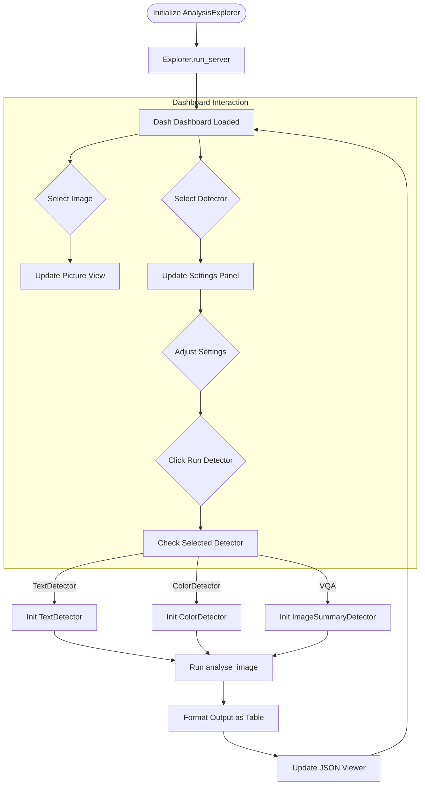

# Display interface for manual inspection

The Display module provides an interactive web-based dashboard for visualizing and analyzing image data using Dash and Bootstrap components.

## Key Features

- **Interactive File Explorer**: Dropdown interface to select images from a dictionary
- **Image Display**: Real-time image preview in the dashboard
- **Multi-Detector Support**: Run different analysis detectors:
  - TextDetector (text extraction and translation)
  - ColorDetector (color analysis)
  - VQA (Visual Question Answering with image summaries)
- **Dynamic Settings**: Context-aware settings panels that appear based on selected detector
- **Real-time Analysis**: Execute analysis on selected images with loading indicators
- **Results Visualization**: JSON-style table display of analysis results
- **Customizable Questions**: Text area for entering custom VQA questions (one per line)
- **Privacy Controls**: Environment variable configuration for privacy disclosure acceptance

## Usage

```python
from ammico.display import AnalysisExplorer

explorer = AnalysisExplorer(mydict=image_dict)
explorer.run_server(port=8050)
```

## Features

- **TextDetector Settings**: Privacy disclosure environment variable configuration
- **ColorDetector Settings**: Delta-E method selection dropdown
- **VQA Settings**: 
  - Analysis type selection (summary, questions, or both)
  - Custom questions textarea (shown/hidden based on analysis type)
  - Model selection (base/large)

## Output

Displays analysis results in an interactive table format, showing all extracted features and metadata for the selected image.

## Workflow

