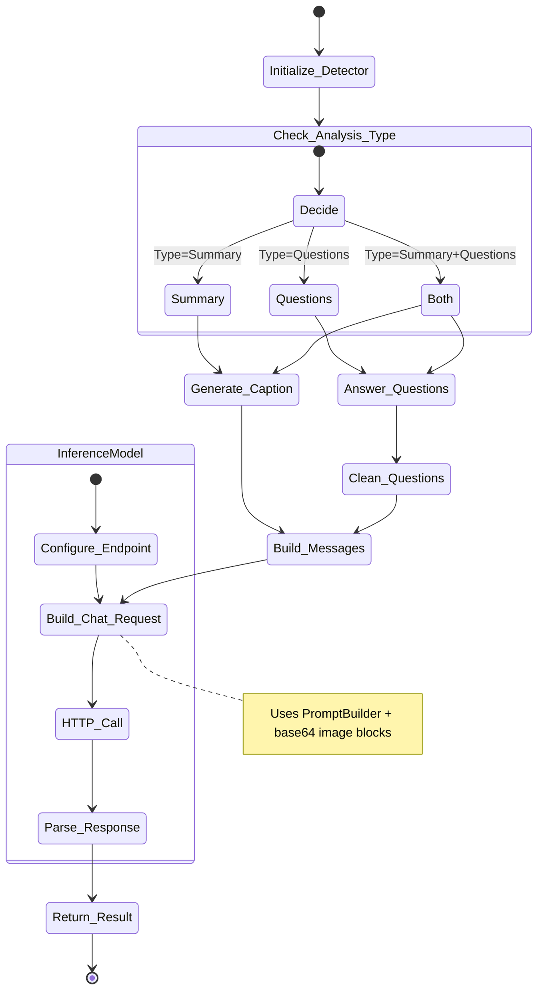

# Image detector: Summary and VQA

The `image_summary` module provides advanced image analysis capabilities using a vision-language model (such as Qwen2.5-VL) hosted externally and reached over an OpenAI-compatible HTTP API. The model answers users' questions about the context of a media file and produces summaries. It combines functionality from the `inference.py` and `prompt_builder.py` modules to offer comprehensive image understanding.

## Core Components

### InferenceModel (`inference.py`)

A thin OpenAI-compatible client that handles vision-language inference against an externally hosted model:

- **Endpoint configuration**: `base_url`, `api_key` and `model_id`, read from the
  `AMMICO_API_BASE_URL`, `AMMICO_API_KEY` and `AMMICO_MODEL_ID` environment variables (or passed
  to the constructor).
- **Provider-agnostic**: the same client targets a self-hosted vLLM server, the OpenAI API, or
  Google Gemini (via its OpenAI-compatibility endpoint) — only configuration changes.
- **Message building**: `build_messages(images, text)` encodes PIL images as base64 blocks for
  the chat API.
- **Inference**: `chat(messages, max_new_tokens, n)` and `chat_batch(...)` (concurrent requests
  via a bounded thread pool, replacing in-GPU batching).
- **Optional dependency**: the `openai` client is installed with `pip install ammico[api]`.

### PromptBuilder (`prompt_builder.py`)

Modular prompt construction system for multi-level analysis:

- **Processing Levels**: Frame, Clip, and Video level prompts
- **Task Types**: Summary generation, VQA, or combined tasks
- **Audio Integration**: Prompts that incorporate audio transcription when available
- **Structured Output**: Ensures consistent, well-formatted model outputs

## Key Features

- **Image Captioning**: Generate concise or detailed captions for images
- **Visual Question Answering (VQA)**: Answer custom questions about image content
- **Batch Processing**: Process multiple images efficiently with configurable batch sizes
- **Flexible Input**: Supports file paths, PIL Images, or sequences of images
- **Analysis Types**:
  - `summary`: Generate image captions only
  - `questions`: Answer questions only
  - `summary_and_questions`: Both caption and Q&A (default)
- **Concise Mode**: Option to generate shorter, more focused summaries and answers
- **Question Chunking**: Automatically processes questions in batches (default: 8 per batch)
- **Error Handling**: Robust error handling with retry logic for CUDA operations

## Usage

```python
from ammico.image_summary import ImageSummaryDetector
from ammico.inference import InferenceModel

# Initialize the inference client (reads AMMICO_API_* env vars, or pass base_url/api_key/model_id)
model = InferenceModel()

# Create detector
detector = ImageSummaryDetector(summary_model=model, subdict={})

# Analyze single image
results = detector.analyse_image(
    entry={"filename": "image.jpg"},
    analysis_type="summary_and_questions",
    list_of_questions=["What is in this image?", "Are there people?"],
    is_concise_summary=True,
    is_concise_answer=True
)

# Batch processing
detector.subdict = image_dict
results = detector.analyse_images_from_dict(
    analysis_type="summary",
    keys_batch_size=16
)
```

## Configuration

- **Max Questions**: Default 32 questions per image (configurable)
- **Batch Size**: Default 16 images per batch (configurable)
- **Token Limits**: 
  - Concise summary: 64 tokens
  - Detailed summary: 256 tokens
  - Concise answers: 64 tokens
  - Detailed answers: 128 tokens

## Output

- `vqa`: List of answers corresponding to questions (if questions requested)

## Workflow

