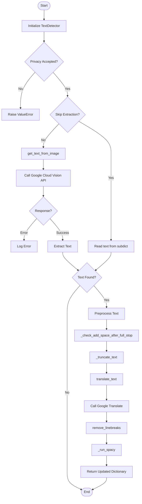

# Text detector

The text is extracted from the images using [google-cloud-vision](https://cloud.google.com/vision). For this, you need an API key. Set up your google account following the instructions on the google Vision AI website or as described [here](../set_up_credentials.md).
You then need to export the location of the API key as an environment variable:
```
export GOOGLE_APPLICATION_CREDENTIALS="location of your .json"
```
The extracted text is then stored under the `text` key (column when exporting a csv).

[Googletrans](https://py-googletrans.readthedocs.io/en/latest/) is used to recognize the language automatically and translate into English. The text language and translated text is then stored under the `text_language` and `text_english` key (column when exporting a csv).

The English text is cleaned from numbers and unrecognized words (`text_clean`).

## Key Features

- **Text Extraction**: Detects and extracts text from images using Google Cloud Vision API
- **Language Detection**: Automatically detects the language of extracted text
- **Translation**: Translates text to English using Google Translate
- **Text Preprocessing**: 
  - Handles formatting issues (adds spaces after periods for translation compatibility)
  - Truncates very long texts (default: 5000 characters)
  - Removes line breaks
- **NLP Analysis**: Integrates with spaCy for advanced text analysis
- **CSV Support**: `TextAnalyzer` class for reading text from CSV files
- **Privacy Controls**: Requires explicit privacy disclosure acceptance before processing

## Usage

```python
from ammico.text import TextDetector

detector = TextDetector(
    subdict={"filename": "image.jpg"},
    skip_extraction=False,  # Set True if text already provided
    accept_privacy="PRIVACY_AMMICO"
)
results = detector.analyse_image()
```

## Output

Returns dictionary with:
- `text`: Original extracted text
- `text_language`: Detected source language code
- `text_english`: Translated English text
- `text_truncated`: Truncated version if original exceeds length limit

## Requirements

- Google Cloud Vision API credentials
- Privacy disclosure acceptance (via environment variable or interactive prompt)
- spaCy English model (`en_core_web_md`)

## Workflow


