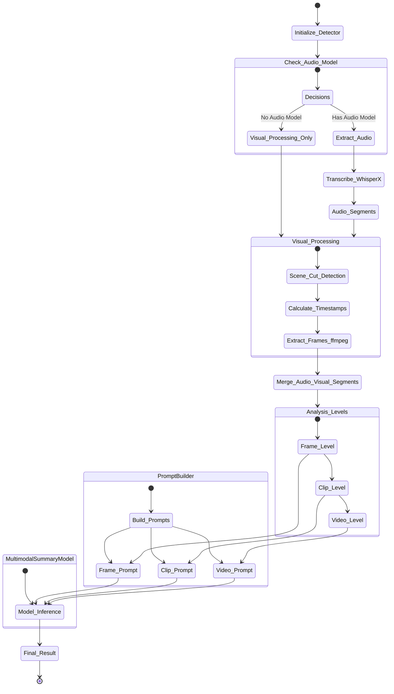

# Video detector: Summary and VQA

The Video Summary module provides comprehensive video analysis combining visual and audio information using multimodal AI models.

## Key Features

- **Multi-Modal Analysis**: Combines visual frames and audio transcription
- **Scene Detection**: Automatically detects scene cuts using frame differencing
- **Frame Extraction**: Extracts keyframes at optimal timestamps using ffmpeg
- **Audio Transcription**: Transcribes audio using WhisperX models with word-level alignment
- **Segment Merging**: Intelligently merges audio phrases and video scenes into coherent segments
- **Hierarchical Processing**: Three-level analysis pipeline:
  1. **Frame Level**: Individual frame analysis with captions and VQA
  2. **Clip Level**: Segment-level summaries combining frames and audio
  3. **Video Level**: Final video summary and Q&A
- **Parallel Processing**: Multi-threaded frame extraction for performance
- **Adaptive Frame Sampling**: Adjusts frame rate based on segment duration
- **Memory Management**: Efficient resource cleanup for audio models

## Audio Features

- **Automatic Audio Detection**: Checks for audio streams in video files
- **Audio Extraction**: Extracts audio using ffmpeg (16kHz mono WAV)
- **Transcription**: Uses WhisperX for accurate transcription with timestamps
- **Word Alignment**: Provides precise timing for each transcribed segment
- **Language Support**: Supports all WhisperX languages with optional language specification

## Visual Features

- **Scene Cut Detection**: Uses adaptive thresholding based on frame differences
- **Smart Frame Selection**: 
  - 2 frames/second for short segments (<2s)
  - 4 frames/second for medium segments (2-20s)
  - 6 frames/second for long segments (>20s)
- **Aspect Ratio Preservation**: Maintains video aspect ratio during frame extraction
- **Multiple Extraction Strategies**: Fallback strategies (MJPEG, PNG) for robust frame extraction
- **Segment Splitting**: Automatically splits segments longer than 25 seconds

## Usage

```python
from ammico.video_summary import VideoSummaryDetector
from ammico.model import MultimodalSummaryModel, AudioToTextModel

# Initialize models
video_model = MultimodalSummaryModel(device="cuda")
audio_model = AudioToTextModel(model_size="large", device="cuda")

# Create detector
detector = VideoSummaryDetector(
    summary_model=video_model,
    audio_model=audio_model,
    subdict={"video1": {"filename": "video.mp4"}}
)

# Analyze video
results = detector.analyse_videos_from_dict(
    analysis_type="summary_and_questions",
    list_of_questions=["What is happening?", "Who is speaking?"]
)
```

## Analysis Pipeline

1. **Audio Processing** (if available):
   - Extract audio track
   - Transcribe with WhisperX
   - Generate timestamped audio segments

2. **Visual Processing**:
   - Detect scene cuts
   - Extract frame timestamps for each scene
   - Extract frames using parallel ffmpeg processes

3. **Segment Merging**:
   - Merge audio and visual boundaries
   - Create coherent temporal segments
   - Reassign frame timestamps to merged segments

4. **Frame-Level Analysis**:
   - Generate captions for each extracted frame
   - Answer questions about individual frames
   - Create summary bullets and VQA bullets

5. **Clip-Level Analysis**:
   - Combine frame summaries with audio transcription
   - Generate segment-level summaries
   - Answer questions using combined audio/visual context

6. **Video-Level Analysis**:
   - Aggregate all segment summaries
   - Generate final video summary
   - Answer questions about the entire video

## Configuration

- **Segment Threshold**: Default 8 seconds for creating new segments
- **Max Segment Duration**: Segments longer than 25 seconds are split
- **Frame Extraction Workers**: Default uses half of available CPU cores (max 8)
- **Output Dimensions**: Max 720px while preserving aspect ratio

## Output

Returns dictionaries with:

- `summary`: Final video summary (if summary requested)
- `vqa_answers`: List of answers to questions (if questions requested)
- `audio_descriptions`: Timestamped audio transcription segments
- Per-segment data with `summary_bullets` and `vqa_bullets`

## Requirements

- ffmpeg and ffprobe for video processing
- CUDA support recommended for performance
- WhisperX models for audio transcription

## Workflow


