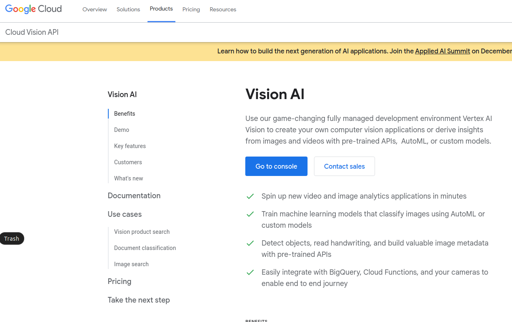
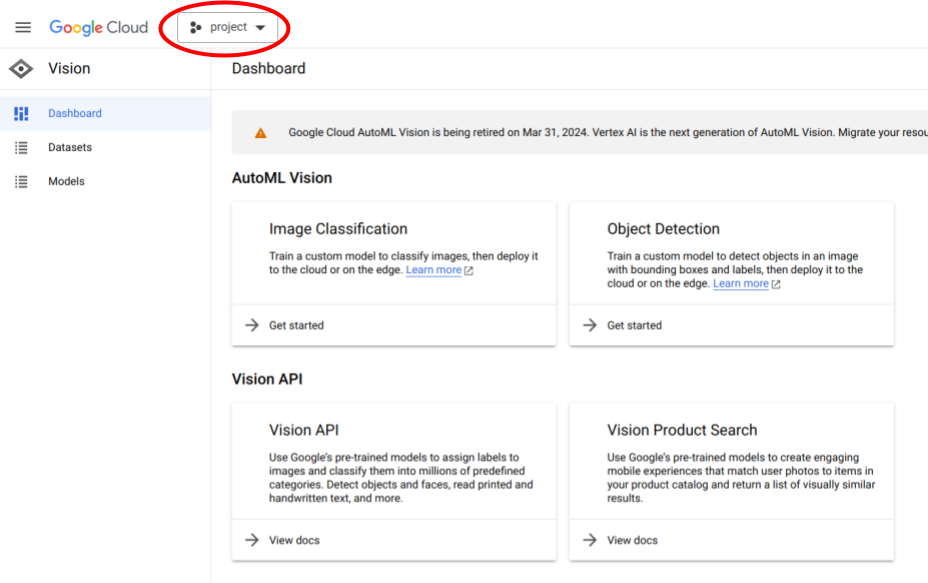
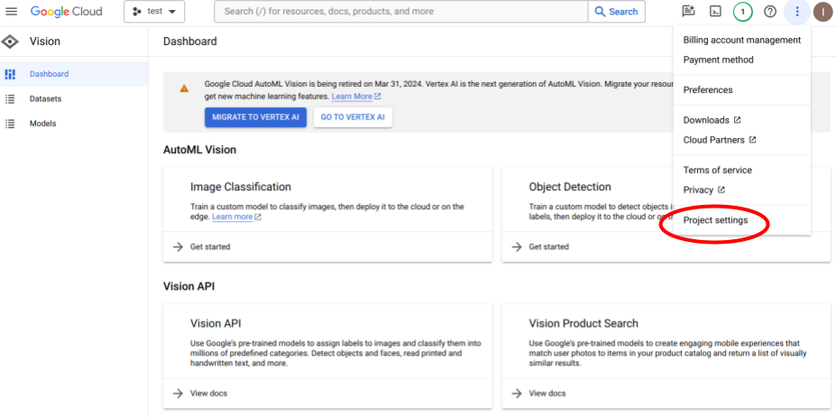
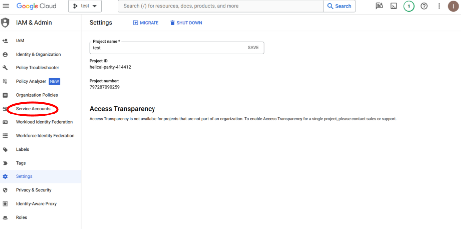
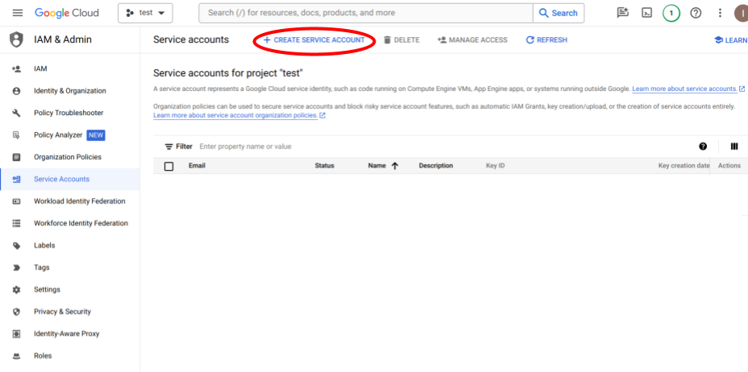
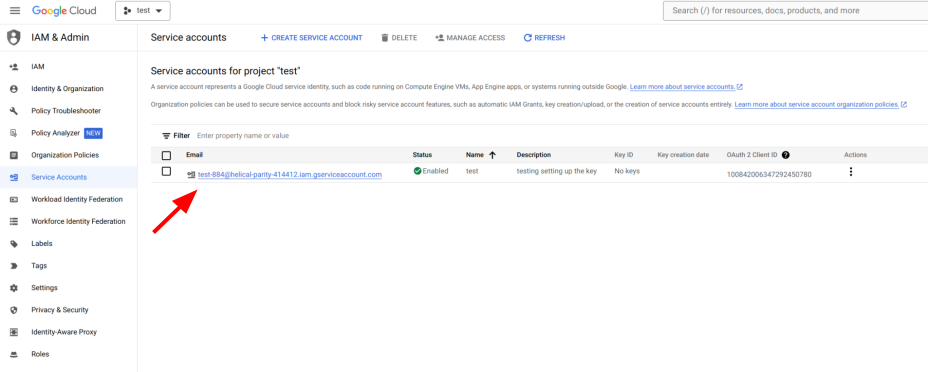
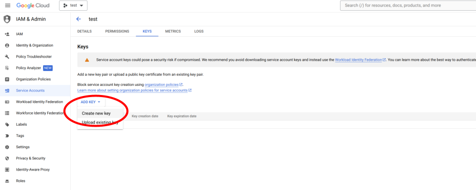
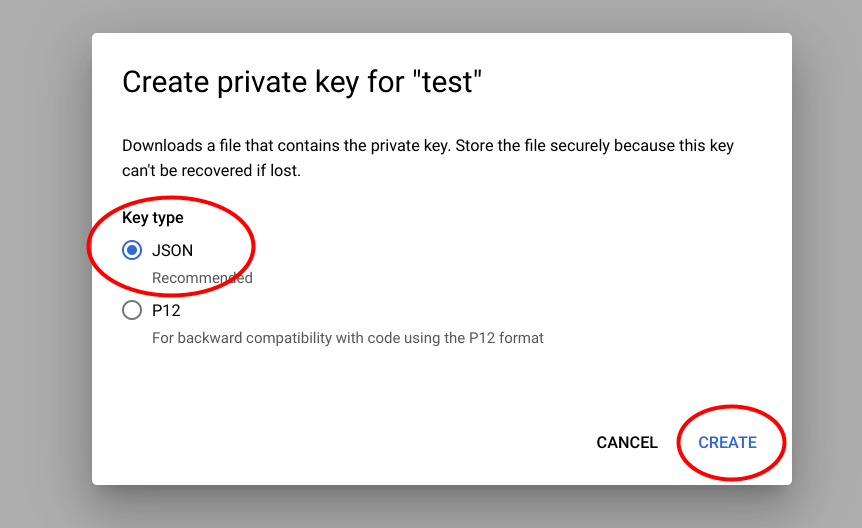
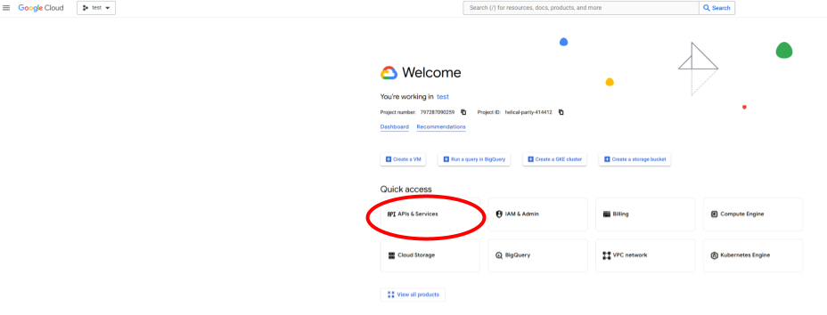
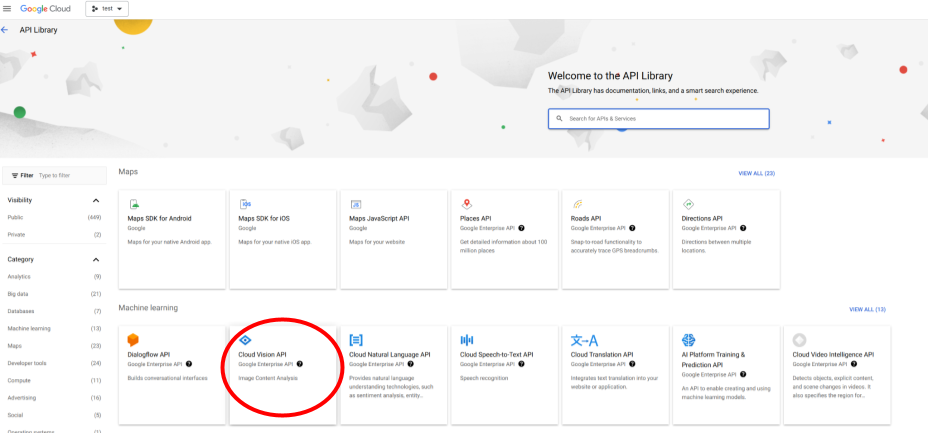

# Instructions how to generate and enable a google Cloud Vision API key

1. Go to [google-cloud-vision](https://cloud.google.com/vision) and click on "Console". Sign into your google account / create a new google account if prompted. This will bring you to the following page, where you click on "project" in the top of the screen.

2. Select "project" from the top left drop-down menu.

3. Click on "NEW PROJECT" on the left of the pop-up window.

4. Enter a project name and click on "CREATE".

5. Now you should be back on the dashboard. In the top right, click on the three vertical dots.

6. In the drop-down menu, select "Project settings".

7. In the menu on the left, click on "Service Accounts".

8. Click on "+ CREATE SERVICE ACCOUNT".

9. Select a service account ID (you can pick this as any name you wish). Click on "DONE".

10. Now your service account should show up in the list of service accounts.

11. Click on the three vertical dots to the right of your service account name and select "Manage keys".

12. Click on "Create new key".

13. In the pop-up window, select "JSON" and click "CREATE".

14. The private key is directly downloaded to your computer. It should be in your downloads folder.

15. The JSON key file will look something like this (any private information has been blanked out in the screenshot).

16. Now go back to your browser window. Click on "Google Cloud" in the top left corner.

17. Now select "APIs & Services".

18. From the selection of APIs, select "Cloud Vision API" or search for it and then select.

19. Click on "ENABLE".

20. Google Cloud Vision API is now enabled for your key.

21. Place the JSON key in a selected folder on your computer and reference this key in your Jupyter Notebook / Python console when running ammico. Or, upload it to your google Drive to use it on google Colaboratory.
22. Make sure that [billing is enabled](https://support.google.com/googleapi/answer/6158867?hl=en) for your google account. You can get the first three month for free; after that, you will be charged if processing more than 1000 images / month (currently $1.50 per 1000 images, see [here](https://cloud.google.com/vision/pricing/)).
