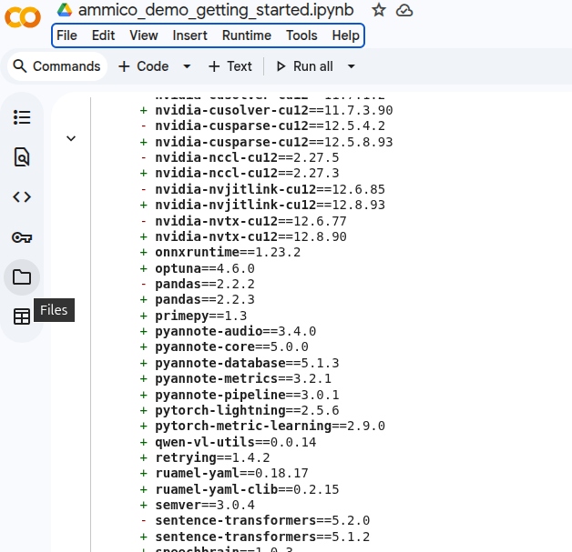

# Getting started with `ammico`
Version date: 28.01.2026

With `ammico`, you can analyze text on images and visual content (image and video) at the same time. This tutorial notebook shows you how, after importing ammico (Step 1) and uploading your data (Step 2), you can use all three modules: text extraction (Step 3), image analysis (Step 4) and video analysis (Step 5). The modules are independent, so you can just perform, for example, image analysis or video analysis without needing to go through the others. 

You can run this notebook on google colab or locally / on your own HPC resource. For production data processing, it is recommended to run the analysis locally on a GPU-supported machine. You can also make use of the colab GPU runtime, or purchase additional runtime. However, google colab comes with pre-installed libraries that can lead to dependency conflicts.

This first cell only runs on google colab; on all other machines, you need to create a conda environment first and install ammico from the Python Package Index using  
```pip install ammico```

Alternatively you can install the development version from the GitHub repository  
```pip install git+https://github.com/ssciwr/AMMICO.git```

<b>On google colab, select "TPU" as runtime, otherwise the notebook may not run. To do so, go to:  
Runtime -> Change runtime type -> Select Hardware accelerator T4 GPU -> Press Save</b>
<!--
<div style="display: flex; justify-content: space-around; align-items: center;">
  
  
</div> -->

Then you need to uninstall the already installed `transformers` version, and `peft`, since these lead to dependency conflicts. Then you can install `ammico`.

Simply execute the cell below by pressing shift+enter.


```python
# CELL #1
# when running on Google colab, otherwise the below cell is skipped
if "google.colab" in str(get_ipython()):
    # uv is a fast Python package manager, see https://github.com/astral-sh/uv
    %pip install uv
    # Uninstall conflicting packages
    !uv pip uninstall peft transformers
    # Install ammico as the latest version from GitHub, which will pull in the compatible dependencies
    !uv pip install git+https://github.com/ssciwr/ammico.git
```

Now you need to restart the kernel to load the new dependencies. **For this, click on "Runtime -> Restart Session" or press Ctrl+M**.

# Step 1: Import AMMICO


```python
# CELL #2
import ammico
```

This imports all the functionality from `ammico`. To analyze images, you need to upload images to google colab or [connect to your Google Drive](https://colab.research.google.com/notebooks/io.ipynb). To connect to your google drive you need to run the cell below.

<!-- To upload files (note that these will not persist over the runtime of the notebook), click on the folder symbol ("Files") on the left navbar and press the upload button.

<div style="display: flex; justify-content: space-around; align-items: center;">
  
  
</div> -->


```python
# CELL #3
from google.colab import drive
drive.mount('/content/drive')
```

# Step 2: Read your image data into AMMICO

`ammico` reads in files from a directory. You can iterate through directories in a recursive manner and filter by extensions. Note that the order of the files may vary on different OS. Reading in these files creates a dictionary `image_dict`, with one entry per image file, containing the file path and filename. This dictionary is the main data structure that ammico operates on and is extended successively with each detector run as explained below.

For reading in the files, the ammico function `find_files` is used, with optional keywords:

| input key | input type | possible input values |
| --------- | ---------- | --------------------- |
`path` | `str` | the directory containing the image files (defaults to the location set by environment variable `AMMICO_DATA_HOME`) |
| `pattern` | `str\|list` | the file extensions to consider (defaults to "png", "jpg", "jpeg", "gif", "webp", "avif", "tiff") |
| `recursive` | `bool` | include subdirectories recursively (defaults to `True`) |
| `limit` | `int` | maximum number of files to read (defaults to `20`, for all images set to `None` or `-1`) |
| `random_seed` | `int` | the random seed for shuffling the images; applies when only a few images are read and the selection should be preserved (defaults to `None`) |


```python
# CELL #4
# Define your data path
data_path = "/content/drive/MyDrive/Test"  # the current directory (make sure you specify the correct path of your folder!)

# Find files and create the image dictionary
image_dict = ammico.find_files(
    path=data_path,
    limit=20,  # Limit the number of files to process (optional)
)
```

# Step 3: Extract the text from images in the dataset


In order to be able to extract the text, you will need a google cloud vision API key. To get such a key follow the instructions here: https://ssciwr.github.io/AMMICO/set_up_credentials/.


```python
# CELL #5
import os
os.environ["GOOGLE_APPLICATION_CREDENTIALS"] = "/content/drive/MyDrive/Test/[KEYNAME].json" # make sure you specify the correct file path of your cloud vision API key
```

To extract the text from images, you will need to run the cell below, and answer "yes" when prompted to accept the privacy disclosure.


```python
# CELL #6
for key in image_dict.keys():
    image_dict[key] = ammico.TextDetector(
        image_dict[key],
    ).analyse_image()

```

    The Text Detector uses Google Cloud Vision
        and Google Translate. Detailed information about how information
        is being processed is provided here:
        https://ssciwr.github.io/AMMICO/build/html/faq_link.html.
        Google’s privacy policy can be read here: https://policies.google.com/privacy.
        By continuing to use this Detector, you agree to send the data you want analyzed
        to the Google servers for extraction and translation.
    Do you accept the privacy disclosure? (yes/no): yes
    You have accepted the privacy disclosure.
    Text detection and translation will be performed.
    


```python
# CELL #7
image_df = ammico.get_dataframe(image_dict)
```

# 3.1 Inspect and save the extracted text data

To inspect the data run the cell below


```python
# CELL #8
image_df.head(20)
```

To save the data, run the cell below.


```python
# CELL #9
image_df.to_csv("/content/drive/MyDrive/Test/text_data_out.csv") # make sure you specify the correct file path of your output file
```

# Step 4. Perform image content analysis

# 4.1. Obtain the image summary

We begin by creating an image caption ("Summary") using the [QWEN 2.5 Vision-Language model family](https://huggingface.co/collections/Qwen/qwen25-vl). Two variants are supported:

This module is built on the Qwen2.5-VL model family. In this project, two model variants are supported:

1. `Qwen2.5-VL-3B-Instruct`, which requires approximately 3 GB of video memory to load.
2. `Qwen2.5-VL-7B-Instruct`, which requires 8.5 GB of VRAM for initialization (default).

First, the model needs to be specified and loaded into memory. This will take several minutes.


```python
# CELL #10
model = ammico.MultimodalSummaryModel()  # load the default model
```

Then, we create an instance of the Python class that handles the image summary and visual question answering tasks:


```python
# CELL #11
image_summary_vqa = ammico.ImageSummaryDetector(summary_model=model, subdict=image_dict)
```

After this, we can create the image captions. Depending on the number of images and the hardware provided, this can take several minutes.


```python
# CELL #12
summary = image_summary_vqa.analyse_images_from_dict(
    analysis_type="summary", is_concise_summary=True
)
```

The results are provided in the updated dictionary. For your convenience, you can execute the cell below to see the image that was analyzed together with the generated caption (summary). This works best for a limited number of images; for larger datasets it is better if you save the data in a .csv file and inspect that file directly (see step 4.3, which you can run without going through 4.2).


```python
# CELL #13
from PIL import Image
import matplotlib.pyplot as plt

for key in summary.keys():
    # Load and display the image
    image_path = summary[key]["filename"]
    img = Image.open(image_path)

    plt.figure(figsize=(8, 6))
    plt.imshow(img)
    plt.axis("off")  # Hide axes
    plt.title(f"Summary: {summary[key]['caption']}", fontsize=12)
    plt.tight_layout()
    plt.show()
```

# 4.2. Visual question answering: obtain answers to user-defined questions about the images

You can also ask questions about the images in the dataset. For this, you need to provide a list of questions and pass it to the Python class instantiated above; to do so, run the two cells below. 


```python
# CELL #14
list_of_questions = [
    "Who is in the picture?",
    "Does the image show a man, a woman, both, none, or you can't tell?",
    "Does the picture show a flag, and if yes, what colors does it have, and to which country or group does it belong?",
]  # add or replace with your own questions
```


```python
# CELL #15
summary_and_answers = image_summary_vqa.analyse_images_from_dict(
    analysis_type="summary_and_questions",
    list_of_questions=list_of_questions,
    is_concise_summary=True,
    is_concise_answer=True,
)
```

For your convenience, the images and the answers to the questions can be displayed together by running the cell below. This works best for a limited number of images (for larger datasets it is recommended that you save them to a .csv file, see step 4.3 below).


```python
# CELL #16
from pprint import pprint

for key in summary_and_answers.keys():
    # Load and display the image
    image_path = summary_and_answers[key]["filename"]
    img = Image.open(image_path)
    for answer in summary_and_answers[key]["vqa"]:
        pprint(answer, width=100, compact=True)
    plt.figure(figsize=(8, 6))
    plt.imshow(img)
    plt.axis("off")  # Hide axes
    plt.tight_layout()
    plt.show()
```

# 4.3. Export the results from the image content analysis

To export the results for further processing, convert the image dictionary into a pandas dataframe.


```python
# CELL #17
image_df = ammico.get_dataframe(image_dict)
```

To examine the data, run the cell below.


```python
# CELL #18
image_df.head(20)
```

To save the data, run the cell below.


```python
# CELL #19
image_df.to_csv("/content/drive/MyDrive/Test/image_summary_questions_data_out.csv") # make sure you specify the correct file path of your output file
```

# Step 5: Perform video content analysis

Depending on whether you arrive at this step after performing image content analysis or not, and depending on your computer resource capabilities, you may have to restart the session and import ammico again. To do so, run the cell below.


```python
# CELL #20
import ammico
```

# 5.1 Read your video data into AMMICO

`ammico` reads in files from a directory. You can iterate through directories in a recursive manner and filter by extensions. Note that the order of the files may vary on different OS. Reading in these files creates a dictionary `video_dict`, with one entry per image file, containing the file path and filename. This dictionary is the main data structure that ammico operates on and is extended successively with each detector run as explained below.

For reading in the files, the ammico function `find_videos` is used, with optional keywords:

| input key | input type | possible input values |
| --------- | ---------- | --------------------- |
| `path` | `str` | the directory containing the video files (defaults to the location set by environment variable `AMMICO_DATA_HOME`) |
| `pattern` | `str\|list` | the file extensions to consider (defaults to "mp4", "mov", "avi", "mkv", "webm") |
| `recursive` | `bool` | include subdirectories recursively (defaults to `True`) |
| `limit` | `int` | maximum number of files to read (defaults to `20`, for all images set to `None` or `-1`) |
| `random_seed` | `int` | the random seed for shuffling the videos; applies when only a few videos are read and the selection should be preserved (defaults to `None`) |


```python
# CELL #21
# Define your data path
data_path = "/content/drive/MyDrive/Test"  # the current directory (make sure you specify the correct path of your folder!)

# Find files and create the image dictionary
video_dict = ammico.find_videos(
    path=data_path,
    limit=2,  # Limit the number of files to process (optional)
)
```

# 4.2. Obtain the video summary

We begin by creating a video caption ("Summary") using the [QWEN 2.5 Vision-Language model family](https://huggingface.co/collections/Qwen/qwen25-vl). Two variants are supported:

This module is built on the Qwen2.5-VL model family. In this project, two model variants are supported:

1. `Qwen2.5-VL-3B-Instruct`, which requires approximately 3 GB of video memory to load.
2. `Qwen2.5-VL-7B-Instruct`, which requires 8.5 GB of VRAM for initialization (default).

The optimal length of the video is more than 30s and less than ~2-3 minutes. The former is due to possible inaccuracies with the automated language detection from the audio, which requires sufficient data to be accurate (however, you may also specify the language). The latter is due to the high compute demand for long videos.

First, the model needs to be specified and loaded into memory. This will take several minutes.


```python
# CELL #22
model = ammico.MultimodalSummaryModel()  # load the default model
```

To analyze the audio content from the video, `ammico` uses the [WhisperX model family](https://github.com/m-bain/whisperX) for audio transcription as [developed by OpenAI](https://arxiv.org/abs/2303.00747). The available flavors available are:

1. `small`
2. `base`
2. `large`

These models can also detect many languages and provide translations, however are more accurate for longer videos.


```python
# CELL #23
audio_model = ammico.model.AudioToTextModel(model_size="small", device="cuda")
```

Then, we create an instance of the Python class that handles the image summary and visual question answering tasks:


```python
# CELL #24
vid_summary_vqa = ammico.VideoSummaryDetector(
    summary_model=model, audio_model=audio_model, subdict=video_dict
)
```

After this, we can create the video captions. Depending on the length and number of videos and the hardware provided, this can take several minutes.


```python
# CELL #25
summary = vid_summary_vqa.analyse_videos_from_dict(analysis_type="summary")
```

The results are provided in the updated dictionary. For your convenience, you can see the first frame of the video that was analyzed together with the generated caption (summary) by executing the cell below. This works best for a limited number of videos (for larger datasets it is recommended that you save the results to a csv file, see below at step 5.4, which you can run without needing to go through 5.3).


```python
# CELL #26
import cv2
import matplotlib.pyplot as plt
from pprint import pprint


def display_first_frame(video_path):
    cap = cv2.VideoCapture(video_path)
    ok, frame = cap.read()
    cap.release()
    if not ok:
        raise RuntimeError(f"Could not read first frame from {video_path}")
    # Convert BGR -> RGB for matplotlib
    frame_rgb = cv2.cvtColor(frame, cv2.COLOR_BGR2RGB)
    plt.figure(figsize=(8, 6))
    plt.imshow(frame_rgb)
    plt.axis("off")
    plt.tight_layout()
    plt.show()


for key in summary.keys():
    # Load and display the image
    video_path = summary[key]["filename"]
    display_first_frame(video_path)
    pprint(summary[key]["summary"], width=100, compact=True)
```

# 5.3. Visual question answering: obtain answers to user-defined questions about the videos

You may also ask questions about the videos. For this, provide a list of questions and pass it to the Python class that you have instantiated above. Note that the question answering takes longer than video summarization. Ideally you would carry out both tasks together in one exection as below:


```python
# CELL #27
list_of_questions = [
    "Who are the people in the video?",
    "Is Donald Trump in the video, answer with only yes or no?",
    "Are people in the video displaying any emotion? If yes, which ones?",
]  # add or replace with your own questions
```


```python
# CELL #28
summary_and_answers = vid_summary_vqa.analyse_videos_from_dict(
    analysis_type="summary_and_questions", list_of_questions=list_of_questions
)
```

For your convenience, the first frame of the videos and the answers to the questions can be displayed together by running the cell below. This works best for a limited number of videos (for larger datasets it is recommended that you save the results to a csv file, see below).


```python
# CELL #29
for key in summary_and_answers.keys():
    # Load and display the image
    video_path = summary_and_answers[key]["filename"]
    display_first_frame(video_path)

    for answer in summary_and_answers[key]["vqa_answers"]:
        pprint(answer, width=100, compact=True)
```

# 5.4. Export the results from the video content analysis

To export the results for further processing, convert the image dictionary into a pandas dataframe.


```python
# CELL #30
video_df = ammico.get_dataframe(video_dict)
```

Inspect the dataframe:


```python
# CELL #31
video_df.head(5)
```

Export the dataframe to a csv file:


```python
# CELL #32
video_df.to_csv("/content/drive/MyDrive/Test/video_summary_questions_data_out.csv") # make sure you specify the correct file path of your output file
```
