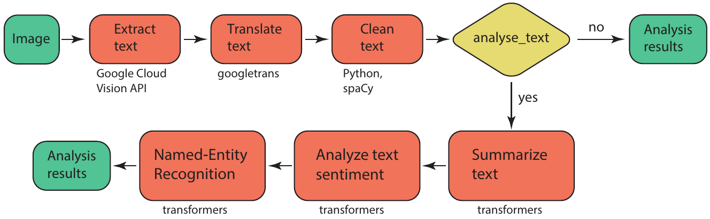

# The detector modules
The different detector modules with their options are explained in more detail in this section.
## Text detector
Text on the images can be extracted using the `TextDetector` class (`text` module). The text is initally extracted using the Google Cloud Vision API and then translated into English with googletrans. The translated text is cleaned of whitespace, linebreaks, and numbers using Python syntax and spaCy. 



The user can set if the text should be further summarized, and analyzed for sentiment and named entity recognition, by setting the keyword `analyse_text` to `True` (the default is `False`). If set, the transformers pipeline is used for each of these tasks, with the default models as of 03/2023. Other models can be selected by setting the optional keyword `model_names` to a list of selected models, on for each task: `model_names=["sshleifer/distilbart-cnn-12-6", "distilbert-base-uncased-finetuned-sst-2-english", "dbmdz/bert-large-cased-finetuned-conll03-english"]` for summary, sentiment, and ner. To be even more specific, revision numbers can also be selected by specifying the optional keyword `revision_numbers` to a list of revision numbers for each model, for example `revision_numbers=["a4f8f3e", "af0f99b", "f2482bf"]`. 

Please note that for the Google Cloud Vision API (the TextDetector class) you need to set a key in order to process the images. This key is ideally set as an environment variable using for example
```
os.environ["GOOGLE_APPLICATION_CREDENTIALS"] = "<path_to_your_service_account_key>.json"
```
where you place the key on your Google Drive if running on colab, or place it in a local folder on your machine.

Summarizing, the text detection is carried out using the following method call and keywords, where `analyse_text`, `model_names`, and `revision_numbers` are optional:
```
for num, key in tqdm(
    enumerate(image_dict.keys()), total=len(image_dict)
):  # loop through all images
    image_dict[key] = ammico.TextDetector(
        image_dict[key],  # analyse image with TextDetector and update dict
    ).analyse_image()

    if (
        num % dump_every == 0 | num == len(image_dict) - 1
    ):  # save results every dump_every to dump_file
        image_df = ammico.get_dataframe(image_dict)
        image_df.to_csv(dump_file)

# write output to csv
image_df = ammico.get_dataframe(image_dict)
image_df.to_csv("data_out.csv")
```
The models can be adapted interactively in the notebook interface and the best models can then be used in a subsequent analysis of the whole data set.

A detailed description of the output keys and data types is given in the following table.

| output key | output type | output value |
| ---------- | ----------- | ------------ |
| `text` | `str` | the extracted text in the original language |
| `text_language` | `str` | the detected dominant language of the extracted text |
| `text_english` | `str` | the text translated into English |
| `text_clean` | `str` | the text after cleaning from numbers and unrecognizable words |
| `text_summary` | `str` | the summary of the text, generated with a transformers model |
| `sentiment` | `str` | the detected sentiment, generated with a transformers model |
| `sentiment_score` | `float` | the confidence associated with the predicted sentiment |
| `entity` | `list[str]` | the detected named entities, generated with a transformers model |
| `entity_type` | `list[str]` | the detected entity type |